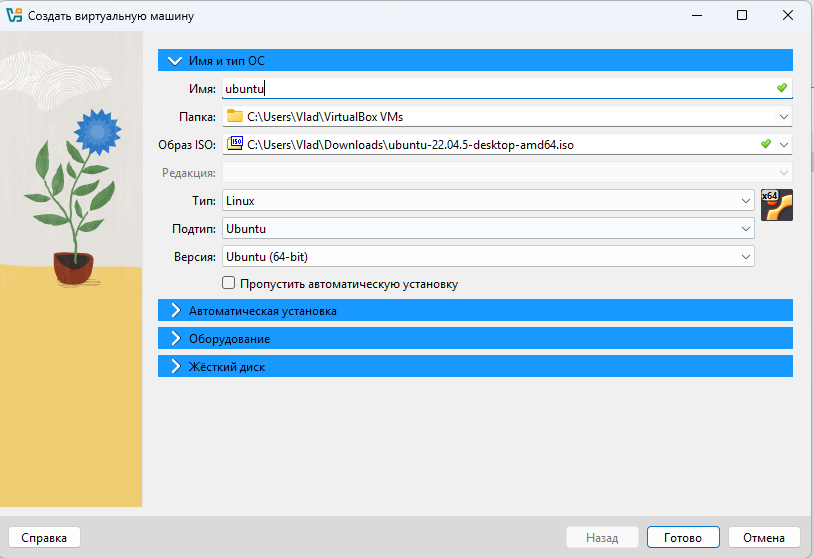
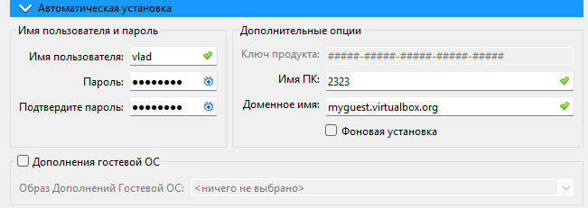
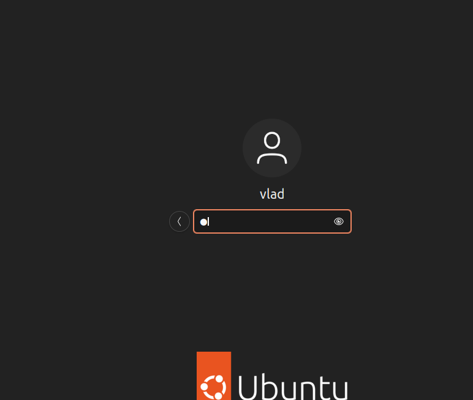
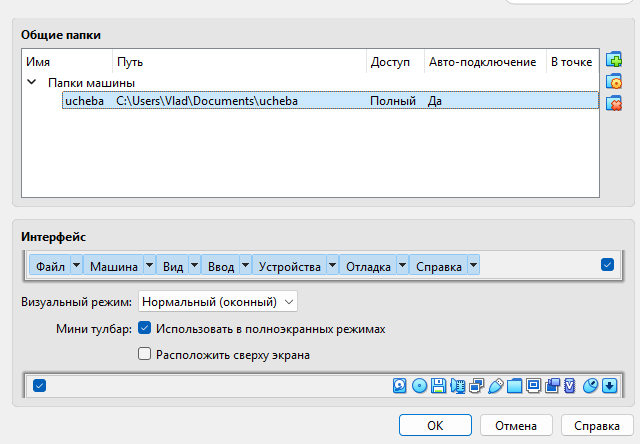
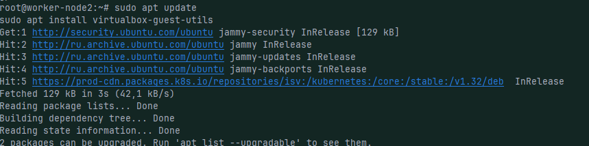
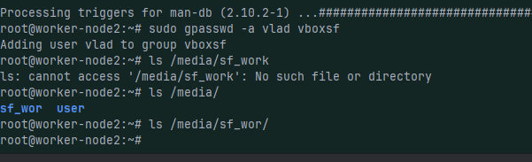

---
## Front matter
lang: ru-RU
title: Операционные системы
subtitle: Управление версиями
author:
  - Субанов Юсуф Жура угли
institute:
  - Российский университет дружбы народов, Москва, Россия
date: 29 мая 2025

## i18n babel
babel-lang: russian
babel-otherlangs: english

## Formatting pdf
toc: false
toc-title: Содержание
slide_level: 2
aspectratio: 169
section-titles: true
theme: metropolis
header-includes:
 - \metroset{progressbar=frametitle,sectionpage=progressbar,numbering=fraction}
---

# Цели и задачи работы

# Цель лабораторной работы
Целью данной работы является приобретение практических навыков установки операционной системы на виртуальную машину, настройки минимально необходимых для дальнейшей работы сервисов.

# Ход выполнения

 

## Создание виртуальной машины

## Создание пользователя в VirtualBox

## Завершение установки и настройка имени хоста

## Добавление общей папки

## Установка гостевых дополнений

## Проверка наличия общей папки в /media

# Выводы по проделанной работе

## Вывод

Мы приобрели практические навыки работы с созданием виртуальной машиной

# Выводы по проделанной работе

## Вывод

Мы приобрели практические навыки работы с созданием виртуальной машиной