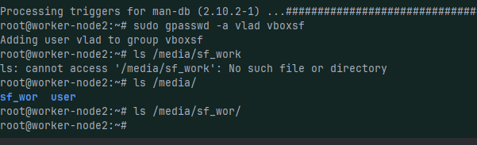

% Лабораторная работа №1
% ФИО: Иванов Иван Иванович
% Группа: Б00-000
% Дата: 15.06.2025

# Цель работы
# Цель работы

Целью данной работы является приобретение практических навыков установки операционной системы на виртуальную машину, настройки минимально необходимых для дальнейшей работы сервисов.

# Ход выполнения

Создаем виртуальную машину 1

Создаине автоматически  пользователя в virtualbox :

Устанвока завершена и пользователь создан и имя хоста задано:

Добавление общей папки:

установка гостевых дополнений:

Убедимся что /media/sf_wor у нас появилась:

